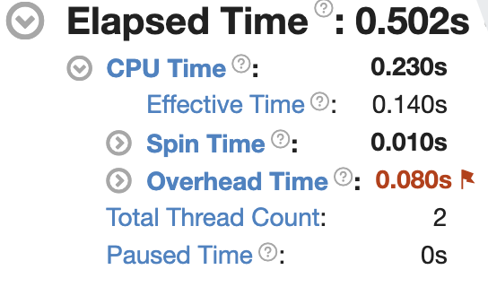
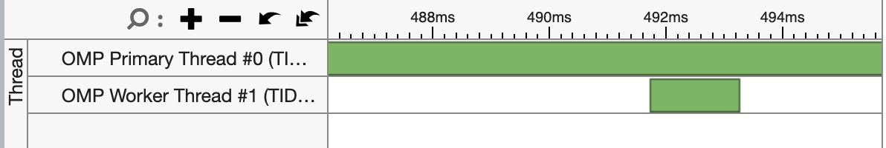
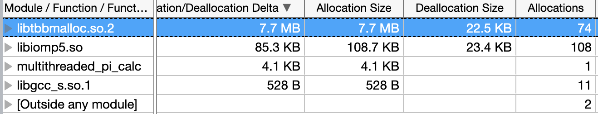
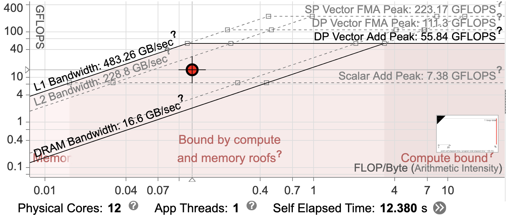

# Vtune & Nsight Profiling
CSCI 596: Scientific Computing and Visualization

## Pre-requisite - Installing the profiler GUI
Download & install the latest version of the Intel oneAPI Vtune Profiler GUI from this [link](https://www.intel.com/content/www/us/en/developer/tools/oneapi/vtune-profiler-download.html).

Upon installation, launch the GUI from the installation directory depending on your OS.
- windows: [Program Files]\Intel\oneAPI\vtune\<version>
- Linux OS: /opt/intel/oneapi/vtune/\<version>
- mac OS: /opt/intel/oneapi/vtune_profiler/\<version>

Download and install the latest version of Intel Advisor [here](https://www.intel.com/content/www/us/en/developer/articles/tool/oneapi-standalone-components.html#advisor)

Upon installation, launch the GUI from from the installation directory depending on your OS.
- windows: [Program Files]\Intel\oneAPI\advisor\<version>
- Linux OS: /opt/intel/oneapi/advisor/\<version>
- mac OS: /opt/intel/oneapi/advisor/\<version>

## CPU profiling with Vtune

The purpose of profiling is to gain insight into the performance of a program while it runs on a given architecture.
We will first try to understand how to carry out profiling on CPU's and then move on on GPU's.

Today's steps should give you an idea about how to carry out algorithm(hotspot), microarchitecture(memory access) and parallelism(threading) analysis for different architectures.

[Intel® VTune™](https://www.intel.com/content/www/us/en/develop/documentation/vtune-help/top.html) is one of the many profiler tools that is suitable for analyzing multithreaded applications on CPU's (well...not just CPU, but for the scope of this discussion we will limit  VTune's application to CPU execution).

> Some examples of other available profilers
- [Tau](http://www.cs.uoregon.edu/research/tau/home.php)
- [Arm Map](https://www.arm.com/products/development-tools/server-and-hpc/forge/map) $$$
- [HPC Toolkit](http://hpctoolkit.org/)
- [PAPI](http://icl.cs.utk.edu/papi/)

> How does a profiler work ?
They make use of the performance counter hardware that is in-built to the architecture.
To check if hardware event-based sampling is enabled on your allocated compute node:
$ cat /proc/sys/kernel/perf_event_paranoid ----> it should give a value of 0

The directory [cpu_profiling](/cpu_profiling) has the source code for this section of the tutorial.

We start with the hotspot analysis on Discovery. Within the [hotspot_analysis](/cpu_profiling/hotspot_analysis) directory we provide the code for serial (single threaded) and parallel (multi threaded) calculation of pi along with the `Makefile` containing rules to build the binaries. You are already familiar with the these codes from previous assignments.

For VTune analysis applications must be compiled with the Intel® Compiler, we can invoke the suitable compiler by loading the load the necessary modules - `intel-oneapi` on discovery cluster with the following commands.

```
salloc --nodes=1 --ntasks=1 --cpus-per-task=2 --partition=debug
module purge
module load intel-oneapi/2021.3
```

We can now build the binaries using the following `make` commands.

```
make singlethreaded_pi_calc
make multithreaded_pi_calc
```
You should have two executables in your working directory.
Set the environment to limit the OpenMp threads
```
export OMP_NUM_THREADS=2
```

Try executing the binaries and see if you get the value of pi

```
$./singlethreaded_pi_calc
PI = 3.141593
$ ./multithreaded_pi_calc
PI = 3.141593
```

Not we capture some profile reports with the following commands
```
vtune -collect hotspots -result-dir rSingleThread ./singlethreaded_pi_calc
vtune -collect hotspots -result-dir rMultiThread ./multithreaded_pi_calc
vtune -collect memory-consumption -result-dir rMultiMemory ./multithreaded_pi_calc

```
This will result in the creation of two reports named `rSingleThread`, `rMultiThread`, `rMultiMemory`. Import the the files to your local machine to view the results.

> To quickly view the results from the command line try
```
vtune -report summary -result-dir rSingleThread/
vtune -report summary -result-dir rMultiThread/
```

We prefer using the GUI for analysis since it is feature rich and helps with the top-down tree view during analysis. Launch the GUI as listed in the pre-requisite section.

To load the profile report click on the three lines displayed on the left bar and select open > Result > \<your report file>. Your report file will end with a .vtune extension.

## Inference

We see that a total of 2 threads are created in the execution

We can analyze the activity of the threads that are forked

We also see the memory allocations and deallocations happening across the call stack.

## Roofline analysis with advisor
For this section we will be working on Devcloud's compute node. We will be referring to the sample code provided by intel. This is made available to you under the [roofline_analysis](/cpu_profiling/roofline_analysis) directory.

We request compute resources with the following command
```
qsub -I -l nodes=1:xeon:ppn=2 -d .
```
Compile the project with the `make` command and generate a roofline report with the following command.

```
 advisor --collect=roofline --project-dir=eRooflineSample -- ./release/roofline_demo
```

Import the report to your local machine and view it with the Advisor GUI. Steps to download and open advisor are mentioned in the pre-requisite section.

## Quirks

To see the list of available architecture-specific libraries on your compute node use the `$lscpu` command. We use the `-march=core-avx2` option when compiling on Discovery's compute nodes since the compute node on debug queue support the [Advenced Vector Instructions](https://en.wikipedia.org/wiki/Advanced_Vector_Extensions)(AVX).
To precisely check for AVX compatibility try
`lscpu | grep avx` on your allocated compute node.

## Inference

We see our program sits in a region which signals it is approaching the limits of the bandwidth and compute bounds of the architecture.

## Acknowledgements

A huge thanks to Prof. Aiichiro Nakano for suggesting I present performance profiling tools to the CSCI 596 class of Fall 21. I am also indebted to Dr. Marco Olguin, Computational Scientist at USC CARC for all the information and support in making the profiling and roofline analysis possible on Discovery's nodes.
